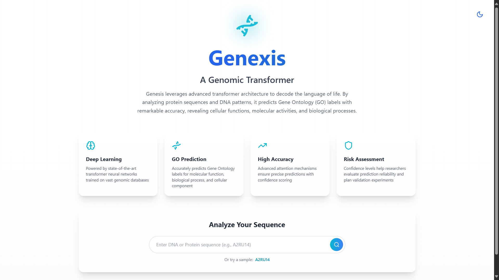
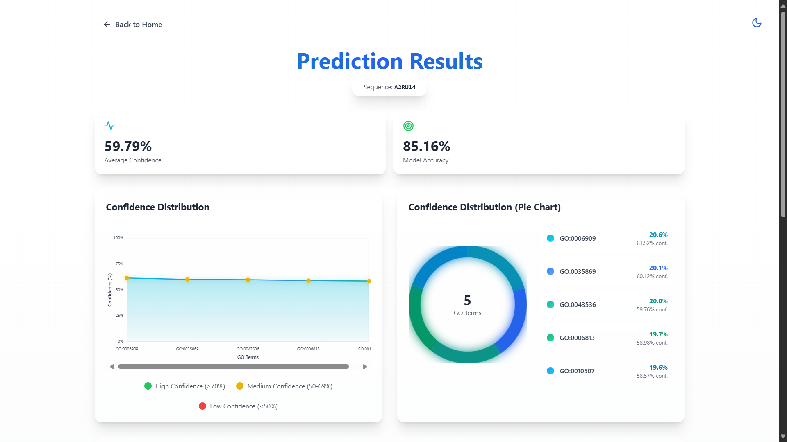
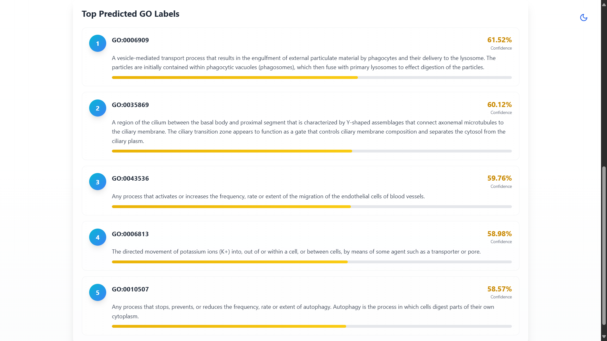

# 🧬 GENEXIS: A Custom Hybrid Dual-Encoder Transformer for Predicting Gene-Disease Association

GENEXIS is an AI-powered biomedical research framework that leverages **Transformer architectures**, **Large Language Models (LLMs)**, and **Bioinformatics** to predict gene-disease associations with greater accuracy and interpretability.

Traditional approaches often analyze DNA or protein sequences independently, relying on manually curated datasets or statistical correlation methods. These techniques struggle to capture the complex biological relationships that exist across multiple genomic data sources.

To address this challenge, we developed **GENEXIS**, a **Hybrid Dual-Encoder Transformer** that simultaneously learns from DNA nucleotide sequences and protein amino acid sequences through two specialized transformer encoders. By combining representations from both biological modalities, the model develops a richer understanding of gene functions and their associations with diseases.

Beyond prediction, GENEXIS integrates **Retrieval-Augmented Generation (RAG)** and **Large Language Models (LLMs)** to retrieve and synthesize biological knowledge from trusted repositories such as **UniProt**, **Gene Ontology (GO)**, **Ensembl**, **PubMed**, **ClinVar**, and **STRING**. This enables the system to generate not only accurate predictions but also explainable insights backed by scientific literature and biological evidence.

---

## 🔬 Key Highlights

- 🧬 **Hybrid Dual-Encoder Transformer** for multi-modal biological sequence learning
- 🤖 **LLM-powered Explainable AI** for genomic research
- 📚 **Retrieval-Augmented Generation (RAG)** using trusted biomedical databases
- 🧠 Simultaneous analysis of **DNA** and **protein** sequences
- 📊 Improved prediction of gene-disease associations with interpretable outputs
- 🌐 Scalable architecture for precision medicine, disease research, and biomedical knowledge discovery

---

## 💡 Technologies Used

- Python
- PyTorch
- Transformers
- Large Language Models (LLMs)
- Retrieval-Augmented Generation (RAG)
- Bioinformatics
- Gene Ontology (GO)
- UniProt
- Ensembl
- PubMed
- ClinVar
- STRING
- Machine Learning
- Deep Learning
- Data Science

---

## 🚀 Project Vision

GENEXIS represents the intersection of **Artificial Intelligence**, **Data Science**, and **Computational Biology**, demonstrating how modern transformer architectures and LLMs can accelerate biomedical discovery and support the future of precision medicine.

Published in **IEEE** and indexed in **Scopus**, this project marks an important milestone in my journey as an aspiring **Data Scientist** and **AI Engineer**, reinforcing my passion for building intelligent systems that create real-world impact.

---

## 📄 Research Publication

**IEEE Xplore:**  
https://ieeexplore.ieee.org/document/11496960

---

# 📸 GENEXIS in Action

Experience the complete workflow of **GENEXIS**, from sequence submission to explainable Gene Ontology (GO) predictions powered by our Hybrid Dual-Encoder Transformer.
Due to patent issues, the backend transformer model isn't been uploaded to GitHub 
Website for Genexis is under progress 
 

## 🏠 Landing Page

  

  <em>
  A clean and intuitive interface where users can submit DNA or protein sequences for analysis. 
  The platform highlights its transformer-based architecture, prediction capabilities, and confidence-driven evaluation.
  </em>

---

## 📊 Prediction Dashboard

  

  <em>
  Interactive dashboard presenting prediction confidence, model accuracy, confidence distribution, and graphical visualizations of Gene Ontology (GO) predictions.
  </em>

---

## 🧬 Top Predicted Gene Ontology (GO) Labels

  

  <em>
  Ranked Gene Ontology predictions with confidence scores and biological descriptions, providing interpretable insights into predicted molecular functions and biological processes.
  </em>

---
